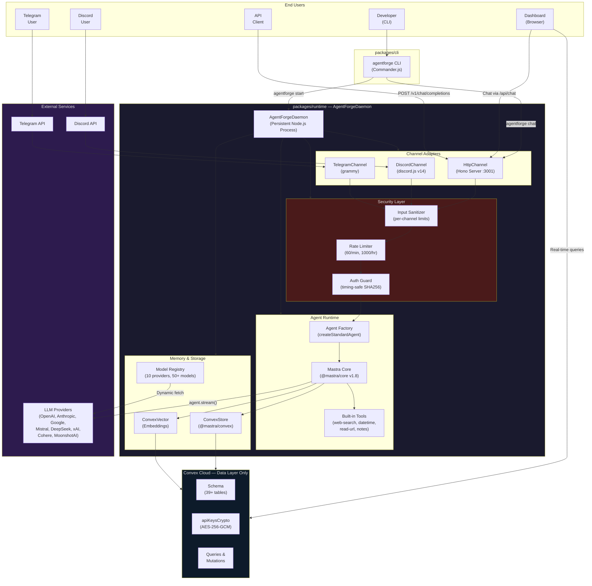
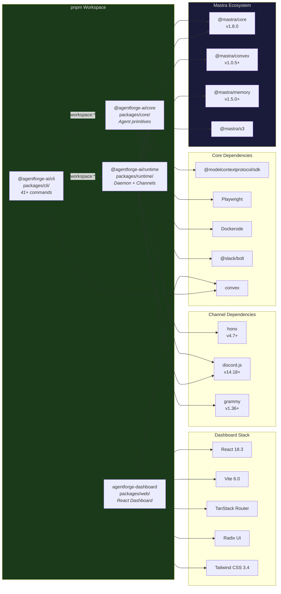
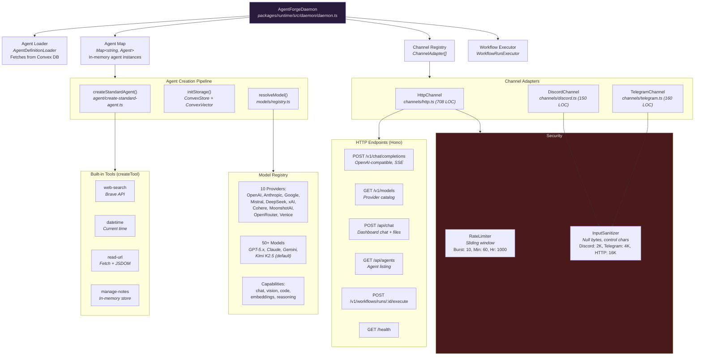
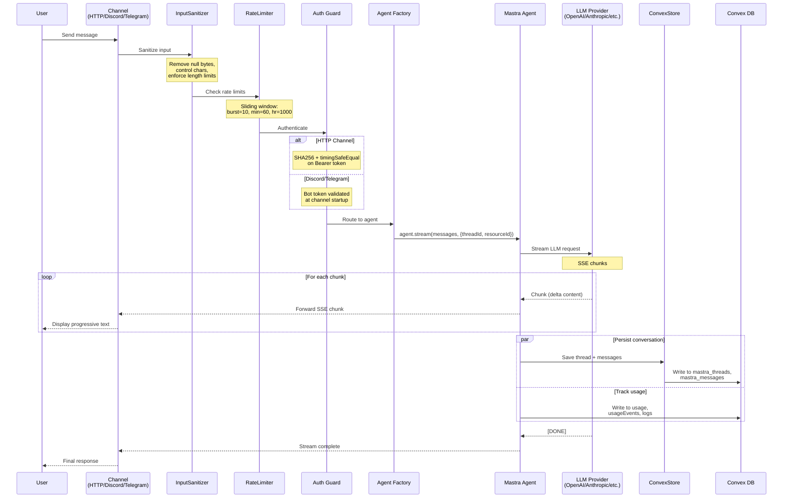
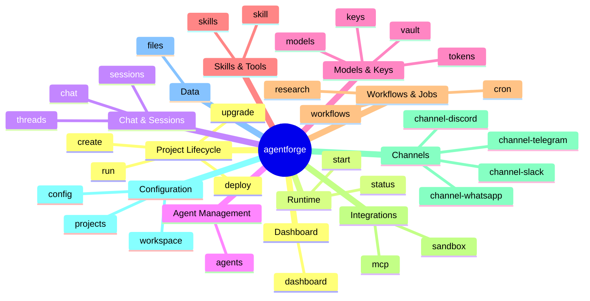
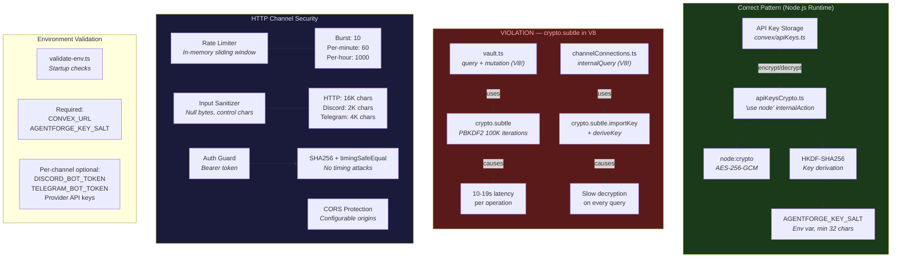
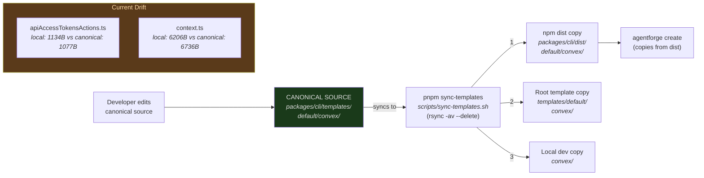
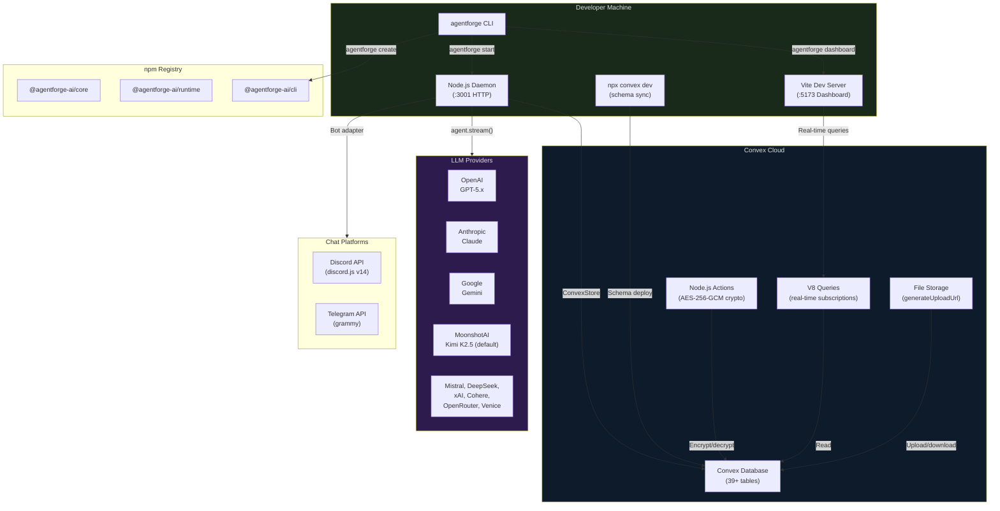

# AgentForge Architecture Diagrams

> Generated 2026-03-11 | v0.12.22 | Comprehensive system architecture reference

---

## 1. High-Level System Architecture

The central daemon model — Mastra runs as a persistent Node.js process, Convex serves as the data layer only.

---

## 2. Package Dependency Graph

Monorepo structure showing workspace dependencies and external packages.

---

## 3. Runtime Daemon Internal Architecture

Detailed view of the AgentForgeDaemon class and its subsystems.

---

## 4. Data Flow — Chat Message Lifecycle

End-to-end flow of a chat message through the system.

---

## 5. Convex Data Layer — Entity Relationship Diagram

All 39+ tables with key relationships.

```mermaid
erDiagram
    projects ||--o{ agents : "has"
    projects ||--o{ threads : "has"
    projects ||--o{ files : "has"
    projects ||--o{ cronJobs : "has"
    projects ||--o{ skills : "has"
    projects ||--o{ mcpConnections : "has"
    projects ||--o{ channelConnections : "has"
    projects ||--o{ workflowDefinitions : "has"
    projects ||--o{ researchJobs : "has"
    projects ||--o{ memoryEntries : "has"
    projects ||--o{ projectMembers : "has"

    agents ||--o{ threads : "conversations"
    agents ||--o{ sessions : "sessions"
    agents ||--o{ cronJobs : "schedules"
    agents ||--o{ instances : "runs"
    agents ||--o{ heartbeats : "monitors"
    agents ||--o{ memoryEntries : "remembers"
    agents ||--o{ a2aTasks : "delegates"

    threads ||--o{ messages : "contains"
    threads ||--o{ sessions : "tracked_by"

    cronJobs ||--o{ cronJobRuns : "executions"

    workflowDefinitions ||--o{ workflowRuns : "executions"
    workflowRuns ||--o{ workflowSteps : "steps"

    vault ||--o{ vaultAuditLog : "audited_by"

    memoryEntries ||--o{ memoryConsolidations : "consolidated_into"

    files }o--|| folders : "in_folder"
    folders }o--o| folders : "nested_in"

    projects {
        string name
        string description
        string defaultModel
        string systemPrompt
        boolean isDefault
    }

    agents {
        string id PK
        string name
        string model
        string provider
        string instructions
        boolean isActive
        boolean sandboxEnabled
    }

    threads {
        string name
        string agentId FK
        string userId
    }

    messages {
        id threadId FK
        string role
        string content
        any tool_calls
    }

    apiKeys {
        string provider
        string encryptedKey
        string iv
        string tag
        boolean isActive
    }

    vault {
        string name
        string category
        string encryptedValue
        string iv
        string maskedValue
    }

    sessions {
        string sessionId
        id threadId FK
        string agentId FK
        string status
        string channel
    }

    usage {
        string agentId FK
        string provider
        string model
        number promptTokens
        number completionTokens
        number cost
    }

    channelConnections {
        string agentId FK
        string channel
        object config
        string status
    }

    a2aTasks {
        string taskId PK
        string fromAgentId FK
        string toAgentId FK
        string status
        string instruction
    }

    memoryEntries {
        string content
        string type
        string agentId FK
        array embedding
        number importance
    }

    skillMarketplace {
        string name
        string version
        string author
        number downloads
        boolean featured
    }

    mastra_threads {
        string id PK
        string resourceId
        string title
    }

    mastra_messages {
        string id PK
        string thread_id FK
        any content
        string role
    }

    mastra_vectors {
        string id PK
        string indexName
        array embedding
    }
```

---

## 6. CLI Command Tree

All 41+ commands organized by category.

---

## 7. Security Architecture

Encryption, authentication, and protection layers — including known violations.

---

## 8. Template Sync Flow

4-location synchronization mechanism ensuring scaffolded projects get latest templates.

---

## 9. Deployment Architecture

How AgentForge runs in development and production.

---

## Legend

| Symbol | Meaning |
|--------|---------|
| Solid arrow | Direct dependency / data flow |
| Dashed arrow | Async / eventual flow |
| Green background | Healthy / correct pattern |
| Red background | Violation / needs fix |
| Orange background | Warning / drift detected |

---

*Generated by Claude Opus 4.6 — Architecture audit of AgentForge v0.12.22*
