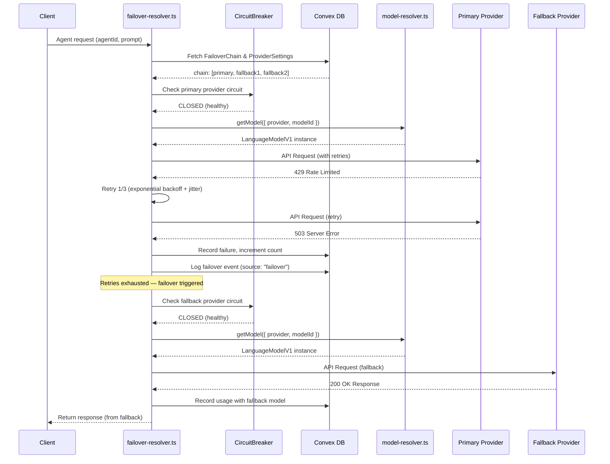
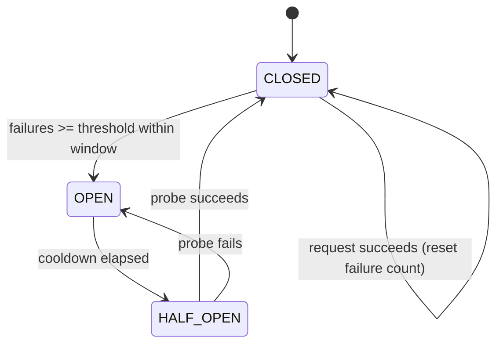

# AgentForge Model Failover Chains: Technical Specification

**Issue:** [agentforge#39](https://github.com/Agentic-Engineering-Agency/agentforge/issues/39) | **Linear:** [AGE-44](https://linear.app/agentic-engineering/issue/AGE-44/model-failover-chains)
**Branch:** `eduardolalo1999/age-44-model-failover-chains`
**Status:** Draft
**Author:** Manus AI
**Created:** 2026-02-17
**Milestone:** Phase 1 — Foundation (Q1 2026)

---

## 1. Introduction

### 1.1. Background

AgentForge currently operates on a single-model-per-agent architecture. Each agent record in the `agents` table stores a single `model` string and a `provider` string, which the `model-resolver.ts` module in the `@agentforge-ai/convex-adapter` package resolves into a `LanguageModelV1` instance from the Vercel AI SDK. The six supported providers are OpenAI, Anthropic, Google, Venice, OpenRouter, and custom OpenAI-compatible endpoints.

This rigid structure introduces a significant single point of failure. If a provider experiences an outage, an API key is rate-limited, or a model degrades in performance, the agent's functionality is immediately compromised. The AgentForge Feature Parity Roadmap [5] identifies Model Failover Chains as a P1 priority within Phase 1 (Foundation), noting that "model failover prevents downtime." This specification addresses that requirement.

### 1.2. Goals

The primary goal is to define a robust, configurable, and automated model failover system. This system will enhance the platform's reliability by dynamically routing requests to backup models when failures occur. The design draws on established patterns from four industry-leading systems: OpenClaw's configurable failover chains with exponential backoff cooldowns [1], Portkey AI Gateway's circuit breaker pattern with percentage-based thresholds [2], LiteLLM's two-level retry-then-fallback architecture [3], and Vercel AI Gateway's transparent model-level failover [4].

### 1.3. Scope

| In Scope | Out of Scope |
| :--- | :--- |
| Data models in Convex for failover chains, provider settings, and circuit breaker state | Dynamic load balancing based on latency or cost (architecture will support future extension) |
| Failover trigger logic for HTTP errors, timeouts, and rate limits | Automatic model selection based on prompt content or complexity |
| Circuit breaker pattern with configurable thresholds and cooldowns | Dashboard UI for configuring failover chains (separate spec, per issue #39 requirements) |
| Configurable retry policy with exponential backoff and jitter | |
| Integration within `@agentforge-ai/convex-adapter` alongside existing `model-resolver.ts` | |
| Failover event logging with hooks for Opik and Bugsink observability | |
| Unit and integration test strategy using Vitest | |

### 1.4. Glossary

| Term | Definition |
| :--- | :--- |
| **Failover Chain** | An ordered list of model identifiers defining the sequence of models to try upon failure. |
| **Model Identifier** | A string (`"provider/model"`) or object (`{ provider, model }`) that uniquely identifies a model. Both formats are supported for compatibility with the existing `parseModelString` function and the config format from issue #39. |
| **Circuit Breaker** | A design pattern that detects failures and prevents repeated attempts against a failing provider, inspired by Portkey's implementation [2]. |
| **BYOK** | Bring Your Own Key — the existing pattern where users supply their own API keys per provider, stored encrypted in the `apiKeys` and `vault` tables. |

---

## 2. System Architecture

### 2.1. Request Flow

The failover logic will be encapsulated in a new `failover-resolver.ts` file within the `@agentforge-ai/convex-adapter` package. This module orchestrates calls to the existing `model-resolver.ts`, which remains the single source of truth for resolving a `ModelResolverConfig` into a `LanguageModelV1` instance. The separation of concerns ensures that the existing `getModel()` function is untouched and that failover is a composable layer on top.

The sequence diagram below illustrates the end-to-end request lifecycle. The agent request enters `failover-resolver.ts`, which fetches the failover chain and circuit breaker state from Convex. It then iterates through the chain, checking the circuit breaker for each provider, attempting the call with retries, and failing over to the next model if all retries are exhausted.



### 2.2. Circuit Breaker State Machine

The circuit breaker operates as a three-state machine for each provider within a user's scope. This pattern is directly inspired by Portkey AI Gateway's circuit breaker [2], with an important addition from Portkey's design: if **all** providers in a chain have their circuits open, the system will bypass the circuit breaker and attempt the last provider as a last resort, rather than failing immediately.



| State | Behavior |
| :--- | :--- |
| **CLOSED** | Normal operation. Requests pass through. Failures are counted within a sliding time window. |
| **OPEN** | Provider is considered unhealthy. Requests are immediately skipped to the next model in the chain. The circuit remains open for the configured `cooldownSeconds`. |
| **HALF-OPEN** | After the cooldown elapses, a single probe request is allowed through. Success transitions to CLOSED; failure returns to OPEN with a reset cooldown timer. |

---

## 3. Data Model (Convex Schema)

All configurations are stored in Convex to leverage its real-time subscriptions, enabling live dashboard updates when provider health changes. The schema is aligned with the existing user-centric data model, which uses `userId: v.string()` as the primary scope (there is no `organizations` table in the current schema). Agent references use `agentId: v.string()` to match the custom string IDs in the `agents` table.

### 3.1. New Tables

Three new tables will be added to `convex/schema.ts`:

```typescript
// convex/schema.ts — additions

const modelIdentifierObject = v.object({
  provider: v.string(),
  model: v.string(),
});

// Failover chain configuration per user (default) or per agent (override)
failoverChains: defineTable({
  userId: v.string(),
  agentId: v.optional(v.string()),  // Agent's custom string ID; null = user default
  chain: v.array(
    v.union(v.string(), modelIdentifierObject)
  ),
  isEnabled: v.boolean(),
  createdAt: v.number(),
  updatedAt: v.number(),
})
  .index("by_user_agent", ["userId", "agentId"])
  .index("by_user", ["userId"]),

// Per-provider retry and circuit breaker settings
providerSettings: defineTable({
  userId: v.string(),
  provider: v.string(),           // "openai", "anthropic", "google", etc.
  timeoutSeconds: v.number(),     // Request timeout (default: 120)
  maxRetries: v.number(),         // Retry attempts before failover (default: 2)
  backoffMs: v.number(),          // Base backoff duration in ms (default: 1000)
  backoffStrategy: v.union(v.literal("linear"), v.literal("exponential")),
  jitter: v.boolean(),            // Add random jitter to backoff
  failureThreshold: v.number(),   // Failures to open circuit (default: 5)
  failureWindowSeconds: v.number(), // Sliding window for counting failures (default: 60)
  cooldownSeconds: v.number(),    // Duration circuit stays OPEN (default: 300)
})
  .index("by_user_provider", ["userId", "provider"]),

// Real-time circuit breaker state per provider
circuitBreakerStates: defineTable({
  userId: v.string(),
  provider: v.string(),
  state: v.union(
    v.literal("CLOSED"),
    v.literal("OPEN"),
    v.literal("HALF-OPEN")
  ),
  failureCount: v.number(),
  firstFailureTimestamp: v.optional(v.number()),
  openedTimestamp: v.optional(v.number()),
  lastProbeTimestamp: v.optional(v.number()),
})
  .index("by_user_provider", ["userId", "provider"]),
```

### 3.2. Configuration Hierarchy

The failover chain supports two levels of configuration, following the same pattern used by Portkey [2] and OpenClaw [1] for strategy inheritance:

1. **Per-User Default:** A document in `failoverChains` where `agentId` is `undefined` serves as the default failover strategy for all agents belonging to that user.
2. **Per-Agent Override:** A document where `agentId` is specified overrides the user's default chain for that particular agent, enabling granular control for critical or specialized agents.

The resolution logic is straightforward: query for a chain matching both `userId` and `agentId`; if none exists, fall back to the chain matching `userId` with `agentId` undefined; if neither exists, the agent operates in single-model mode (backward-compatible).

---

## 4. TypeScript Interfaces

New types will be defined in `packages/convex-adapter/src/failover-types.ts` to ensure type safety across the failover system.

```typescript
// packages/convex-adapter/src/failover-types.ts

import type { LLMProvider, ModelResolverConfig } from './types.js';

/**
 * A model identifier supporting both string format ("provider/model")
 * and the object format from issue #39 ({ provider, model }).
 */
export type ModelIdentifier = string | { provider: string; model: string };

/**
 * Configuration for a failover chain stored in Convex.
 */
export interface FailoverChainConfig {
  _id: string;
  userId: string;
  agentId?: string;
  chain: ModelIdentifier[];
  isEnabled: boolean;
}

/**
 * Retry and circuit breaker settings for a specific provider.
 * Stored in the providerSettings table.
 */
export interface ProviderSettings {
  userId: string;
  provider: string;
  timeoutSeconds: number;
  maxRetries: number;
  backoffMs: number;
  backoffStrategy: 'linear' | 'exponential';
  jitter: boolean;
  failureThreshold: number;
  failureWindowSeconds: number;
  cooldownSeconds: number;
}

/**
 * Default provider settings applied when no user-specific config exists.
 */
export const DEFAULT_PROVIDER_SETTINGS: Omit<ProviderSettings, 'userId' | 'provider'> = {
  timeoutSeconds: 120,
  maxRetries: 2,
  backoffMs: 1000,
  backoffStrategy: 'exponential',
  jitter: true,
  failureThreshold: 5,
  failureWindowSeconds: 60,
  cooldownSeconds: 300,
};

/**
 * Circuit breaker state for a provider.
 */
export type CircuitState = 'CLOSED' | 'OPEN' | 'HALF-OPEN';

/**
 * A failover event logged for observability.
 */
export interface FailoverEvent {
  fromModel: string;
  toModel: string;
  reason: FailoverReason;
  latencyMs: number;
  timestamp: number;
}

export type FailoverReason =
  | 'HTTP_5XX'
  | 'RATE_LIMIT'
  | 'AUTH_ERROR'
  | 'TIMEOUT'
  | 'CIRCUIT_OPEN'
  | 'UNKNOWN';
```

---

## 5. Failover Triggers

The system classifies errors into two categories: those that warrant a failover and those that should be returned directly to the user. This classification draws on the trigger patterns used by all four reference systems.

| Status Code(s) | Error Type | Action | Rationale |
| :--- | :--- | :--- | :--- |
| `500`, `502`, `503`, `504` | Server-Side Error | **Retry, then Failover** | Provider infrastructure issue. Retries may resolve transient errors. |
| `429` | Rate Limit Exceeded | **Immediate Failover** | Failing over immediately provides a faster response and reduces pressure on the rate-limited key. Matches Portkey's default behavior [2]. |
| `401` / `403` | Authentication Error | **Immediate Failover** | Invalid, expired, or disabled API key. No point retrying. |
| Client-side timeout | Request Timeout | **Retry, then Failover** | Provider is unresponsive. Configurable per-provider via `timeoutSeconds`. |
| `400` (context window) | Token Limit Exceeded | **No Failover** | Client-side error. Log and return error to user. Following LiteLLM's separate `context_window_fallbacks` concept [3], a future enhancement could route to a model with a larger context window. |

---

## 6. Retry Policy

Retries are the first line of defense against transient errors. The retry policy executes *before* a failover is triggered, meaning the system attempts to complete a request with the **same model** multiple times before giving up and moving to a fallback. This two-level approach (retries within a model, then fallbacks across models) mirrors LiteLLM's `function_with_fallbacks` wrapping `function_with_retries` architecture [3].

### 6.1. Backoff Calculation

The backoff delay between retries is calculated as follows:

```typescript
// packages/convex-adapter/src/failover-resolver.ts

function calculateBackoff(
  attempt: number,
  settings: Pick<ProviderSettings, 'backoffMs' | 'backoffStrategy' | 'jitter'>
): number {
  const { backoffMs, backoffStrategy, jitter } = settings;

  let delay: number;
  if (backoffStrategy === 'exponential') {
    delay = backoffMs * Math.pow(2, attempt); // 1000, 2000, 4000, ...
  } else {
    delay = backoffMs * (attempt + 1); // 1000, 2000, 3000, ...
  }

  if (jitter) {
    // Add random jitter between 0% and 25% of the delay
    delay += Math.random() * delay * 0.25;
  }

  // Cap at 60 seconds (following Portkey's cumulative retry cap)
  return Math.min(delay, 60_000);
}
```

### 6.2. Retry Flow

1. A request to a model is initiated.
2. If the request fails with a retryable error (5xx or timeout), the system checks the retry count.
3. If `currentRetries < maxRetries`, the system waits for the calculated backoff period and retries the **same model**.
4. If the retry limit is reached, the failure is recorded for the circuit breaker, and the failover process moves to the next model in the chain.

---

## 7. Core Implementation

### 7.1. `failover-resolver.ts`

The new `failover-resolver.ts` file exports a primary function, `callModelWithFailover`, which orchestrates the entire process. It is designed as a Convex `internalAction` so it can read from the database and make external API calls.

```typescript
// packages/convex-adapter/src/failover-resolver.ts

import { getModel, parseModelString } from './model-resolver.js';
import { DEFAULT_PROVIDER_SETTINGS } from './failover-types.js';
import type { ModelIdentifier, FailoverReason, ProviderSettings } from './failover-types.js';
import type { ModelResolverConfig } from './types.js';

/**
 * Normalize a ModelIdentifier (string or object) into a ModelResolverConfig.
 */
export function normalizeIdentifier(identifier: ModelIdentifier): ModelResolverConfig {
  if (typeof identifier === 'string') {
    return parseModelString(identifier);
  }
  return {
    provider: identifier.provider as any,
    modelId: identifier.model,
  };
}

/**
 * Resolve the effective failover chain for an agent.
 * Priority: agent-specific chain > user default chain > single model from agent record.
 */
async function resolveChain(ctx: any, userId: string, agentId: string): Promise<ModelIdentifier[]> {
  // 1. Check for agent-specific chain
  const agentChain = await ctx.runQuery(/* failoverChains.by_user_agent */, { userId, agentId });
  if (agentChain?.isEnabled) return agentChain.chain;

  // 2. Check for user default chain
  const userChain = await ctx.runQuery(/* failoverChains.by_user */, { userId, agentId: undefined });
  if (userChain?.isEnabled) return userChain.chain;

  // 3. Fall back to agent's single model
  const agent = await ctx.runQuery(/* agents.byAgentId */, { id: agentId });
  return [`${agent.provider}/${agent.model}`];
}

/**
 * Main entry point: call a model with automatic failover.
 */
export async function callModelWithFailover(
  ctx: any,
  args: { agentId: string; prompt: string; userId: string }
) {
  const chain = await resolveChain(ctx, args.userId, args.agentId);
  let lastError: Error | null = null;
  let allCircuitsOpen = true;

  for (let i = 0; i < chain.length; i++) {
    const config = normalizeIdentifier(chain[i]);
    const settings = await getProviderSettings(ctx, args.userId, config.provider)
      ?? DEFAULT_PROVIDER_SETTINGS;
    const circuitState = await getCircuitState(ctx, args.userId, config.provider);

    if (circuitState.state === 'OPEN') {
      await logFailoverEvent(ctx, { /* from, to, reason: 'CIRCUIT_OPEN' */ });
      continue;
    }

    allCircuitsOpen = false;
    const result = await attemptWithRetries(ctx, config, args.prompt, settings);

    if (result.success) {
      if (circuitState.state === 'HALF-OPEN') {
        await updateCircuitState(ctx, args.userId, config.provider, 'CLOSED');
      }
      await recordUsage(ctx, { agentId: args.agentId, ...result.usage });
      return result.response;
    }

    lastError = result.error;
    await recordFailure(ctx, args.userId, config.provider, settings);

    if (i < chain.length - 1) {
      const nextConfig = normalizeIdentifier(chain[i + 1]);
      await logFailoverEvent(ctx, {
        fromModel: `${config.provider}/${config.modelId}`,
        toModel: `${nextConfig.provider}/${nextConfig.modelId}`,
        reason: classifyError(result.error),
        latencyMs: result.latencyMs,
      });
    }
  }

  // Portkey-inspired: if ALL circuits are open, try the last provider anyway
  if (allCircuitsOpen && chain.length > 0) {
    const lastConfig = normalizeIdentifier(chain[chain.length - 1]);
    const result = await attemptWithRetries(ctx, lastConfig, args.prompt, DEFAULT_PROVIDER_SETTINGS);
    if (result.success) return result.response;
  }

  throw new Error(`All ${chain.length} models in the failover chain failed. Last error: ${lastError?.message}`);
}
```

---

## 8. Health Monitoring

### 8.1. Provider Health Probes

A scheduled Convex cron job (`healthProbe`) will run every 60 seconds to check providers in the `HALF-OPEN` state. For each such provider, it will send a lightweight API call (e.g., a minimal completion request or a `listModels` call). A successful probe transitions the circuit back to `CLOSED`; a failed probe resets the cooldown timer and returns the circuit to `OPEN`.

### 8.2. Dashboard Widget

A new widget on the AgentForge dashboard will query the `circuitBreakerStates` table via a Convex real-time subscription. Because Convex subscriptions are reactive, the widget will update instantly when a provider's state changes, displaying **Healthy** (CLOSED), **Unhealthy** (OPEN), or **Recovering** (HALF-OPEN) for each provider.

### 8.3. Notifications and Observability

When a failover event occurs or a circuit breaker changes state, the system will log the event to the existing `logs` table with `source: "failover"` and structured metadata in the `metadata` field. These log entries serve as the foundation for two integrations:

- **Opik:** Failover events will be instrumented as spans within the LLM trace, providing visibility into retry chains and latency overhead in the Opik dashboard.
- **Bugsink:** Critical failures (entire chain exhausted, circuit opened) will be reported as errors to Bugsink for alerting and incident tracking.

---

## 9. Usage Tracking

### 9.1. Event Logging

All failover events are recorded in the existing `logs` table with structured metadata:

```typescript
// Example log entry for a failover event
await ctx.runMutation(api.logs.create, {
  level: "info",
  source: "failover",
  message: `Failover: openai/gpt-4o → anthropic/claude-3-opus (RATE_LIMIT)`,
  metadata: {
    fromModel: "openai/gpt-4o",
    toModel: "anthropic/claude-3-opus",
    reason: "RATE_LIMIT",
    latencyMs: 1250,
    agentId: "my-agent",
    attempt: 1,
  },
  userId: "user_123",
  timestamp: Date.now(),
});
```

### 9.2. Cost and Credit Tracking

When a request completes successfully after one or more failovers, the token usage and cost are attributed to the **successful provider and model**. The existing `usage` table and `usage.record` mutation are used without modification, ensuring backward compatibility with the existing analytics dashboard.

### 9.3. Dashboard Analytics

The organization dashboard will be enhanced with a reliability analytics section that queries the `logs` table filtered by `source: "failover"`. This section will visualize failover frequency over time, a breakdown of failover reasons, and the most and least reliable providers.

---

## 10. Testing Strategy

As required by the acceptance criteria in issue #39, a comprehensive testing strategy will be implemented using Vitest.

### 10.1. Unit Tests

Unit tests will cover the pure functions in `failover-resolver.ts`:

- `normalizeIdentifier()` — correctly parses both string and object formats.
- `calculateBackoff()` — produces correct delays for linear, exponential, and jitter configurations.
- `classifyError()` — maps HTTP status codes to the correct `FailoverReason`.
- Circuit breaker state transition logic — verifies CLOSED → OPEN, OPEN → HALF-OPEN, and HALF-OPEN → CLOSED/OPEN transitions.

### 10.2. Integration Tests

Integration tests will use the Convex testing environment to validate the full `callModelWithFailover` flow:

- **Primary succeeds:** Verify no failover occurs and usage is recorded for the primary model.
- **Primary fails, fallback succeeds:** Verify failover event is logged, usage is recorded for the fallback model, and the response is returned.
- **All models fail:** Verify the error is thrown with a descriptive message.
- **Circuit breaker opens:** Simulate repeated failures and verify the circuit transitions to OPEN, skipping the provider on subsequent requests.
- **Circuit breaker recovery:** Verify the HALF-OPEN → CLOSED transition after a successful probe.

---

## 11. Acceptance Criteria

The following criteria must be met for this feature to be considered complete:

| # | Criterion | Verification |
| :--- | :--- | :--- |
| 1 | When a primary model returns a `5xx` error, the system retries and then automatically fails over to the next model in the chain. | Integration test |
| 2 | When a provider is rate-limited (`429`), the request immediately fails over to a different provider. | Integration test |
| 3 | A request exceeding a model's context window returns an error to the user and does **not** trigger a failover. | Unit test |
| 4 | After the configured number of failures within the time window, the circuit breaker transitions to `OPEN`. | Unit + integration test |
| 5 | While a circuit is `OPEN`, no requests are sent to that provider (it is skipped). | Integration test |
| 6 | After the cooldown period, the circuit transitions to `HALF-OPEN` and allows a single probe request. | Integration test |
| 7 | All failover events are logged to the `logs` table with `source: "failover"` and structured metadata. | Integration test |
| 8 | Usage is recorded for the **successful** model, not the failed primary. | Integration test |
| 9 | The system is backward-compatible: agents without a failover chain configured operate in single-model mode. | Integration test |
| 10 | Unit and integration tests achieve at least 90% code coverage for the failover module. | CI pipeline |

---

## 12. References

[1] OpenClaw. (2026). *Model Failover*. [https://docs.openclaw.ai/concepts/model-failover](https://docs.openclaw.ai/concepts/model-failover)
[2] Portkey AI. (2026). *Circuit Breaker*. [https://docs.portkey.ai/docs/product/ai-gateway/circuit-breaker](https://docs.portkey.ai/docs/product/ai-gateway/circuit-breaker)
[3] LiteLLM. (2026). *Fallbacks*. [https://docs.litellm.ai/docs/proxy/reliability](https://docs.litellm.ai/docs/proxy/reliability)
[4] Vercel. (2026). *Model Fallbacks*. [https://vercel.com/docs/ai-gateway/models-and-providers/model-fallbacks](https://vercel.com/docs/ai-gateway/models-and-providers/model-fallbacks)
[5] Agentic Engineering. (2026). *AgentForge Feature Parity Roadmap*. [https://www.notion.so/AgentForge-Feature-Parity-Roadmap-30a20287fd618143be7ec21fcb7da89b](https://www.notion.so/AgentForge-Feature-Parity-Roadmap-30a20287fd618143be7ec21fcb7da89b)
