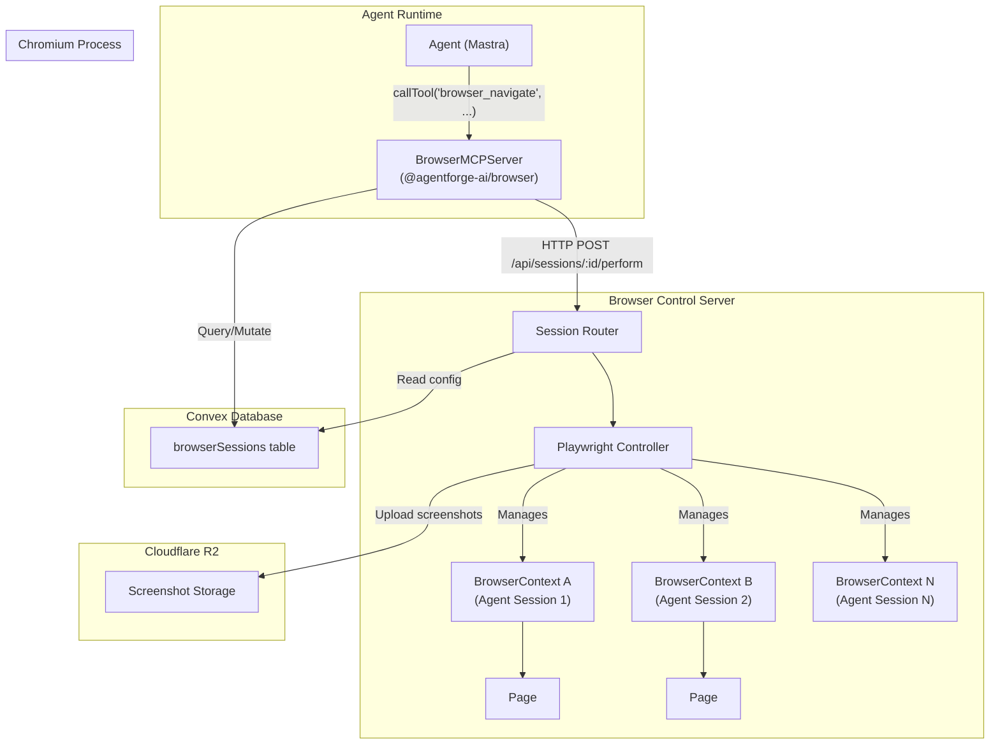
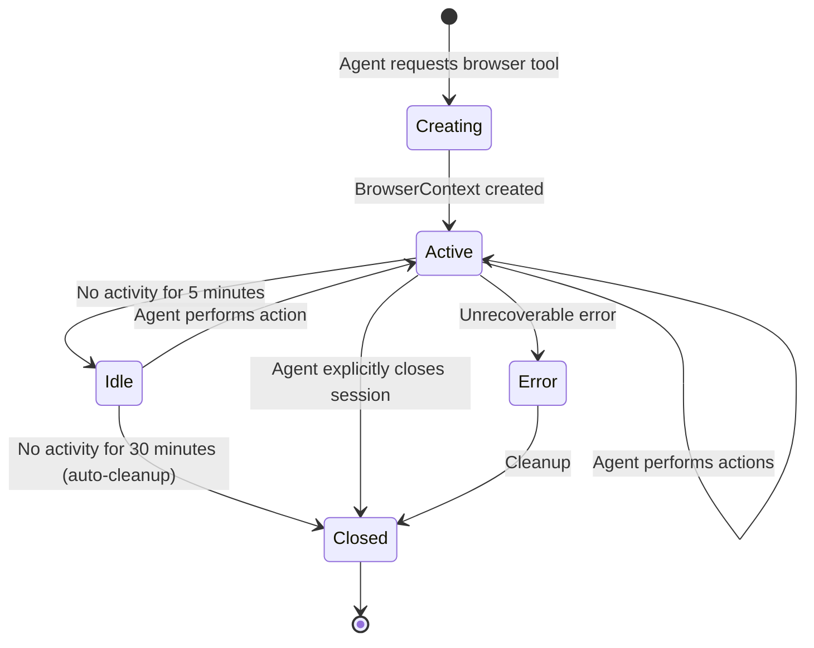

# Spec: [AF-40] Native Browser Automation Tool

**Author:** Manus AI
**Date:** 2026-02-17
**Status:** Proposed
**Priority:** P0 (Critical)
**Milestone:** Phase 2: Execution & Voice (Q2 2026)
**Linear:** [AGE-45](https://linear.app/agentic-engineering/issue/AGE-45)
**GitHub:** [agentforge#40](https://github.com/Agentic-Engineering-Agency/agentforge/issues/40)
**Depends On:** AF-1 (Core Agent Class), AF-2 (Convex Schema)
**Blocks:** AF-51 (Deep Research)

---

## 1. Objective

This specification defines the architecture and implementation plan for a native browser automation tool within the AgentForge framework. Currently, AgentForge agents can only interact with web browsers through external MCP integrations, which introduces latency, fragile configuration, and a dependency on third-party servers. Both Manus (via its Browser Operator, which controls active Chrome tabs through a Chrome extension) and OpenClaw (via a built-in browser control server with CDP, snapshot, screenshot, and ARIA reference support) have native browser tools that are tightly integrated into their agent loops [1] [2]. This feature, tracked as AF-40, is classified as P0 (critical) on the Phase 2 roadmap and is a prerequisite for the Deep Research feature (AF-51), which requires agents to autonomously browse, extract, and synthesize information from the web.

The goal is to deliver a first-class, Playwright-based browser tool that is registered directly in the AgentForge agent tool system, supports per-session isolation, provides LLM-optimized page snapshots, and includes robust security controls. Upon completion, AgentForge agents will be able to navigate websites, fill out forms, extract data, take screenshots, and execute JavaScript, all without leaving the framework's native tool ecosystem.

## 2. Competitive Landscape

Before designing the system, it is essential to understand how existing platforms have solved this problem. The following table summarizes the four primary reference implementations that informed this specification.

| Platform | Architecture | Snapshot Format | Session Model | Key Strength |
| :--- | :--- | :--- | :--- | :--- |
| **Manus Browser Operator** | Chrome extension relay controlling active user tabs | Proprietary (not documented) | User's active browser session (shared cookies/logins) | Leverages the user's existing authenticated sessions; zero setup for the end user. |
| **OpenClaw Browser Tool** | Built-in browser control server with CDP integration | Accessibility tree with ARIA refs (`agent-id` attributes) | Per-session isolated contexts with configurable workspace access | Deep integration with the agent loop; snapshot + screenshot dual-mode for LLM context. |
| **Playwright MCP Server** | Headless Playwright instance exposed via MCP protocol | Accessibility snapshot (simplified tree) or full page screenshot | Single browser instance, multiple tabs | Microsoft-backed; robust accessibility tree extraction; well-documented MCP tool interface. |
| **browser-use Library** | AI-native Python library wrapping Playwright/Selenium | DOM extraction with element indexing | Per-task browser instances | Designed specifically for LLM agents; automatic element detection and action suggestion. |

The Playwright MCP Server and OpenClaw's approach are the most relevant to AgentForge's architecture. Both use Playwright under the hood, both generate accessibility-tree-based snapshots for LLM consumption, and both support headless operation. The key differentiator in our design will be the tight integration with Convex for session persistence and the use of Cloudflare Workers for the control server API in the cloud deployment.

## 3. High-Level Architecture

The architecture introduces three new components: a **Browser Control Server**, a **BrowserMCPServer** package, and a new **Convex table** for session management. The control server runs as a managed sidecar process (in cloud deployments, this will be a Cloudflare Durable Object or a dedicated container; in self-hosted mode, it runs as a local Node.js process). The `BrowserMCPServer` is a new npm package (`@agentforge-ai/browser`) that registers browser tools with the agent and communicates with the control server over HTTP.

### 3.1. System Diagram



### 3.2. Component Responsibilities

The **Agent** invokes browser actions through the standard `callTool` interface. It does not need to know anything about Playwright, CDP, or the control server. From the agent's perspective, the browser is just another tool with a well-defined input/output schema.

The **BrowserMCPServer** (`@agentforge-ai/browser`) is the bridge between the agent framework and the control server. It registers a set of browser tools (one per action type) with the agent's `MCPServer`. When a tool is called, the server translates the call into an HTTP request to the control server, handles errors, and returns the result. It also manages session lifecycle by querying and mutating the `browserSessions` table in Convex.

The **Browser Control Server** is a standalone Node.js application that wraps the Playwright library. It is responsible for launching and managing the Chromium process, creating and destroying `BrowserContext` instances, executing browser commands, and generating page snapshots. In cloud deployments, this server will run as a Cloudflare Durable Object to ensure session affinity (a given session always routes to the same instance). In self-hosted deployments, it runs as a local sidecar process.

The **Convex `browserSessions` table** persists session metadata, enabling the system to recover from restarts and providing the dashboard with real-time visibility into active browser sessions.

## 4. Convex Schema Extension

The following table will be added to `convex/schema.ts`, alongside the existing 18 tables (agents, threads, messages, sessions, files, folders, projects, skills, cronJobs, cronJobRuns, mcpConnections, apiKeys, usage, settings, logs, channels, heartbeats, vault, vaultAuditLog, instances):

```typescript
// convex/schema.ts (addition)

  browserSessions: defineTable({
    sessionId: v.string(),
    agentId: v.string(),
    threadId: v.optional(v.id("threads")),
    userId: v.optional(v.string()),
    status: v.union(
      v.literal("active"),
      v.literal("idle"),
      v.literal("closed"),
      v.literal("error")
    ),
    controlServerUrl: v.string(),
    playwrightContextId: v.string(),
    currentUrl: v.optional(v.string()),
    lastScreenshotUrl: v.optional(v.string()),
    config: v.object({
      headless: v.boolean(),
      viewport: v.object({ width: v.number(), height: v.number() }),
      urlAllowlist: v.optional(v.array(v.string())),
      urlDenylist: v.optional(v.array(v.string())),
      enableEvaluate: v.boolean(),
    }),
    createdAt: v.number(),
    lastActivityAt: v.number(),
    closedAt: v.optional(v.number()),
  })
    .index("bySessionId", ["sessionId"])
    .index("byAgentId", ["agentId"])
    .index("byUserId", ["userId"])
    .index("byStatus", ["status"]),
```

This schema captures not only the session state but also the security configuration (URL allowlists, whether `evaluate` is enabled) and the current navigation state, which is useful for the dashboard UI.

## 5. Tool Interface

Rather than exposing a single monolithic tool with a discriminated union (as initially proposed in the GitHub issue), this specification recommends registering **individual tools per action**. This approach produces cleaner tool descriptions for the LLM, allows the agent to reason about each action independently, and aligns with the Playwright MCP Server's design, which exposes 20+ individual tools [3].

### 5.1. Tool Definitions

```typescript
// packages/browser/src/tools.ts
import { z } from 'zod';
import type { Tool } from '@agentforge-ai/core';

export const navigateTool: Tool = {
  name: 'browser_navigate',
  description: 'Navigate the browser to a URL. Returns the page title and a snapshot of the page content.',
  inputSchema: z.object({
    url: z.string().url().describe('The URL to navigate to. Must include protocol (https://).'),
  }),
  outputSchema: z.object({
    title: z.string(),
    url: z.string(),
    snapshot: z.string(),
  }),
  handler: async (input) => { /* ... */ },
};

export const clickTool: Tool = {
  name: 'browser_click',
  description: 'Click an element on the page identified by its ref from the page snapshot.',
  inputSchema: z.object({
    ref: z.string().describe('The ref of the element to click, from the page snapshot.'),
  }),
  outputSchema: z.object({
    success: z.boolean(),
    snapshot: z.string(),
  }),
  handler: async (input) => { /* ... */ },
};

export const typeTool: Tool = {
  name: 'browser_type',
  description: 'Type text into an input field identified by its ref.',
  inputSchema: z.object({
    ref: z.string().describe('The ref of the input element.'),
    text: z.string().describe('The text to type.'),
    pressEnter: z.boolean().optional().describe('Whether to press Enter after typing.'),
  }),
  outputSchema: z.object({
    success: z.boolean(),
    snapshot: z.string(),
  }),
  handler: async (input) => { /* ... */ },
};

export const screenshotTool: Tool = {
  name: 'browser_screenshot',
  description: 'Take a screenshot of the current page. Returns a URL to the image stored in R2.',
  inputSchema: z.object({}),
  outputSchema: z.object({ screenshotUrl: z.string() }),
  handler: async (input) => { /* ... */ },
};

export const snapshotTool: Tool = {
  name: 'browser_snapshot',
  description: 'Get a text snapshot of the current page content as a simplified accessibility tree.',
  inputSchema: z.object({}),
  outputSchema: z.object({ snapshot: z.string() }),
  handler: async (input) => { /* ... */ },
};

export const evaluateTool: Tool = {
  name: 'browser_evaluate',
  description: 'Execute JavaScript in the browser page context. RESTRICTED: requires org-level permission.',
  inputSchema: z.object({
    js: z.string().describe('The JavaScript code to execute in the page context.'),
  }),
  outputSchema: z.object({ result: z.any() }),
  handler: async (input) => { /* ... */ },
};

export const waitTool: Tool = {
  name: 'browser_wait',
  description: 'Wait for a condition: either a specific element to appear, or a fixed time delay.',
  inputSchema: z.object({
    ref: z.string().optional().describe('The ref of an element to wait for.'),
    timeMs: z.number().optional().describe('Time in milliseconds to wait.'),
  }),
  outputSchema: z.object({ success: z.boolean() }),
  handler: async (input) => { /* ... */ },
};
```

### 5.2. Agent Usage Example

The following example demonstrates how an agent would use the browser tools to research a topic on the web:

```typescript
import { Agent, MCPServer } from '@agentforge-ai/core';
import { createBrowserMCPServer } from '@agentforge-ai/browser';

const browserTools = createBrowserMCPServer({
  controlServerUrl: 'http://localhost:3100',
  headless: true,
});

const agent = new Agent({
  id: 'web-researcher',
  name: 'Web Researcher',
  instructions: `You are a web research agent. Use the browser tools to navigate websites,
    extract information, and compile research reports. Always use browser_snapshot to
    understand the current page before taking actions. Use the ref attribute from the
    snapshot to identify elements for clicking and typing.`,
  model: 'openai/gpt-4o',
});

agent.addTools(browserTools);

const response = await agent.generate(
  'Go to https://news.ycombinator.com and find the top 5 stories about AI.'
);
```

## 6. Page Snapshot Format

The snapshot is the primary mechanism by which the LLM "sees" the web page. Its design is critical to the quality of the agent's browser interactions. After evaluating the approaches used by OpenClaw, Playwright MCP, and browser-use, this specification adopts the **simplified accessibility tree** format, consistent with the Playwright MCP Server's approach.

### 6.1. Format Specification

Each element in the tree will be represented as a single line of text, with indentation to indicate nesting. Interactive elements will be annotated with a stable `ref` attribute that the agent can use in subsequent `click`, `type`, and `wait` commands.

**Example Snapshot Output:**

```
- navigation "Main Navigation"
  - link "Home" [ref=e1]
  - link "Products" [ref=e2]
  - link "About" [ref=e3]
- main "Page Content"
  - heading "Welcome to Example.com" [level=1]
  - text "We build great products for developers."
  - form "Sign Up"
    - textbox "Email address" [ref=e4]
    - textbox "Password" [ref=e5]
    - button "Create Account" [ref=e6]
  - region "Featured Articles"
    - link "How to Build AI Agents" [ref=e7]
    - link "The Future of Edge Computing" [ref=e8]
```

### 6.2. Snapshot vs. Screenshot Decision Matrix

| Scenario | Recommended Mode | Rationale |
| :--- | :--- | :--- |
| **Form filling and navigation** | Snapshot | The accessibility tree provides clear, actionable element references. |
| **Visual verification** | Screenshot | The agent needs to confirm visual layout, colors, or images. |
| **Data extraction from text** | Snapshot | Text content is directly available in the tree without OCR. |
| **Data extraction from charts/images** | Screenshot | Visual content requires image analysis (multimodal model). |
| **Debugging a failed action** | Both | The snapshot shows what the agent "sees"; the screenshot shows the actual page state. |

The `browser_navigate` and `browser_click` tools will automatically return a snapshot in their response, so the agent always has an up-to-date view of the page after each action. The agent can explicitly request a screenshot when visual verification is needed.

## 7. Session Isolation and Lifecycle

### 7.1. Isolation Model

Every agent session will be mapped to a dedicated Playwright `BrowserContext`. This is the strongest isolation primitive available in Playwright, providing complete separation of cookies, local storage, IndexedDB, service workers, and cached resources between sessions [4]. This design ensures that one agent's authenticated session on a website cannot be accessed by another agent, even if they are running on the same Chromium instance.

### 7.2. Session Lifecycle



The idle timeout and auto-cleanup are managed by a Convex scheduled function that runs every 5 minutes, checking the `lastActivityAt` field of all `active` and `idle` sessions. This prevents resource leaks from abandoned sessions.

### 7.3. Cookie and Auth State Persistence

For use cases where an agent needs to maintain a logged-in session across multiple interactions (e.g., monitoring a dashboard daily), the system will support optional cookie persistence. When enabled, the `BrowserContext`'s storage state (cookies + local storage) will be serialized and stored in Cloudflare R2, encrypted with the organization's vault key. On the next session creation for the same agent, the stored state will be loaded into the new `BrowserContext`, effectively restoring the authenticated session.

## 8. Headless vs. Headed Modes

The system will support both headless and headed browser modes, configurable at the session level.

| Mode | Use Case | Deployment |
| :--- | :--- | :--- |
| **Headless** | Production workloads, cloud execution, CI/CD pipelines | Default for cloud deployments. No display required. |
| **Headed** | Local development, debugging, user observation | Available in self-hosted mode. Requires a display (X11/Wayland). |

In headed mode, the user can observe the agent's actions in real-time, which is invaluable for debugging and building trust. The control server will expose a VNC or noVNC endpoint for remote observation in cloud deployments, similar to how OpenClaw allows users to watch their agent's browser activity.

## 9. CDP Support for Advanced Use Cases

While the standard tool interface covers the vast majority of browser automation needs, some advanced use cases require direct access to the Chrome DevTools Protocol (CDP). Examples include network interception (e.g., blocking ads or tracking requests), performance profiling, and custom protocol domains.

The `browser_evaluate` tool provides a limited form of CDP access by allowing JavaScript execution in the page context. For full CDP access, the Browser Control Server will expose an optional WebSocket endpoint that proxies CDP messages directly to the underlying Chromium instance. This endpoint will be gated behind an organization-level feature flag and will require explicit opt-in, as it bypasses all security controls.

```typescript
// Advanced CDP usage (requires explicit opt-in)
const cdpResponse = await fetch(
  `${controlServerUrl}/api/sessions/${sessionId}/cdp`,
  {
    method: 'POST',
    headers: { 'Authorization': `Bearer ${apiKey}` },
    body: JSON.stringify({
      method: 'Network.enable',
      params: {},
    }),
  }
);
```

## 10. Security Considerations

Browser automation introduces significant security risks. The following table outlines the primary threats and their mitigations.

| Threat | Severity | Mitigation |
| :--- | :--- | :--- |
| **Arbitrary JavaScript execution** | Critical | The `browser_evaluate` tool is disabled by default. It can only be enabled at the organization level by an admin. All invocations are logged to the `vaultAuditLog` table. |
| **Navigation to malicious sites** | High | Organizations can configure URL allowlists and denylists in the `browserSessions.config` field. The control server enforces these before executing any navigation. A default denylist blocks known malicious domains. |
| **Credential theft via session sharing** | High | Each agent session uses a dedicated `BrowserContext` with complete cookie and storage isolation. Sessions are automatically cleaned up after inactivity. |
| **Resource exhaustion (DoS)** | Medium | The control server enforces per-organization limits on concurrent sessions (default: 5 for free tier, 25 for pro, 100 for enterprise). Each session has a maximum lifetime of 1 hour. |
| **Data exfiltration via screenshots** | Medium | Screenshots are stored in the organization's Cloudflare R2 bucket with the same access controls as other files. Screenshot URLs are signed and expire after 1 hour. |
| **Script injection via user-provided selectors** | Medium | All selectors passed to Playwright are sanitized. The `ref`-based selector system eliminates the need for arbitrary CSS/XPath selectors, reducing the attack surface. |

## 11. Implementation Plan

The implementation is divided into three phases, each lasting approximately two weeks, for a total estimated effort of six weeks.

### Phase 1: Browser Control Server (Weeks 1-2)

This phase focuses on building the standalone control server that wraps Playwright.

| Task | Effort | Description |
| :--- | :--- | :--- |
| Project scaffolding | 1 day | Create the Node.js project with TypeScript, Playwright dependency, and HTTP server (Hono). |
| Session manager | 3 days | Implement `BrowserContext` creation, destruction, and lifecycle management. |
| Action executor | 3 days | Implement handlers for all seven browser actions (navigate, click, type, screenshot, snapshot, evaluate, wait). |
| Snapshot generator | 2 days | Implement the accessibility tree extraction and formatting logic using Playwright's `page.accessibility.snapshot()`. |
| HTTP API | 1 day | Expose RESTful endpoints for session management and action execution. |

### Phase 2: AgentForge Integration (Weeks 3-4)

This phase integrates the control server with the AgentForge framework.

| Task | Effort | Description |
| :--- | :--- | :--- |
| `@agentforge-ai/browser` package | 2 days | Create the npm package with tool definitions and the `createBrowserMCPServer` factory. |
| Convex schema extension | 1 day | Add the `browserSessions` table and implement queries/mutations. |
| Session lifecycle in adapter | 3 days | Update `ConvexAgentAdapter` to automatically create and manage browser sessions when browser tools are present. |
| Screenshot storage | 1 day | Implement screenshot upload to Cloudflare R2 with signed URL generation. |
| Integration tests | 3 days | Write end-to-end tests covering all browser actions, session isolation, and error handling. |

### Phase 3: Security, CDP, and Dashboard (Weeks 5-6)

This phase adds security controls, advanced features, and the dashboard UI.

| Task | Effort | Description |
| :--- | :--- | :--- |
| URL allowlist/denylist | 2 days | Implement domain filtering in the control server with Convex-backed configuration. |
| Evaluate gating | 1 day | Implement the org-level feature flag for `browser_evaluate` with audit logging. |
| CDP proxy endpoint | 2 days | Implement the optional WebSocket CDP proxy with authentication. |
| Dashboard browser view | 3 days | Build the real-time browser session view in the web dashboard using Convex reactive queries (`useQuery`). |
| Documentation | 2 days | Write user-facing documentation, API reference, and security guide for the Notion wiki. |

**Total Estimated Effort: 6 weeks (1 engineer)**

## 12. Acceptance Criteria

The following criteria must be met for this feature to be considered complete:

1. All seven browser tools (`browser_navigate`, `browser_click`, `browser_type`, `browser_screenshot`, `browser_snapshot`, `browser_evaluate`, `browser_wait`) are registered and functional in the agent tool system via the `MCPServer` interface.
2. An agent can autonomously navigate a website, fill out a form, and extract data using only the browser tools, verified by an end-to-end integration test.
3. Browser sessions are fully isolated between different agents and different users, verified by an integration test that confirms cookies are not shared across `BrowserContext` instances.
4. The page snapshot format produces a clean, LLM-readable accessibility tree with stable `ref` attributes that can be used in subsequent `click` and `type` commands.
5. The `browser_evaluate` tool is disabled by default and can only be enabled by an organization admin via the dashboard settings.
6. URL allowlists and denylists are enforced by the control server, and navigation to blocked domains returns a clear error message.
7. Screenshots are stored in Cloudflare R2 with signed, time-limited URLs.
8. The AgentForge dashboard displays active browser sessions with real-time status updates via Convex reactive queries.
9. The feature is documented in the AgentForge wiki on Notion and the `docs/` directory of the repository.
10. All integration tests pass in CI/CD (GitHub Actions).
11. The feature closes the browser automation gap identified in the [Feature Parity comparison](https://www.notion.so/30a20287fd618160b054d463cd8911a3) [5].

## 13. References

[1]: https://docs.openclaw.ai/tools/browser "OpenClaw Browser Tool Documentation"
[2]: https://manus.im "Manus AI Platform"
[3]: https://github.com/microsoft/playwright-mcp "Playwright MCP Server (Microsoft)"
[4]: https://playwright.dev/docs/api/class-browsercontext "Playwright BrowserContext API"
[5]: https://www.notion.so/30a20287fd618160b054d463cd8911a3 "Feature Parity: Manus vs OpenClaw vs AgentForge"
