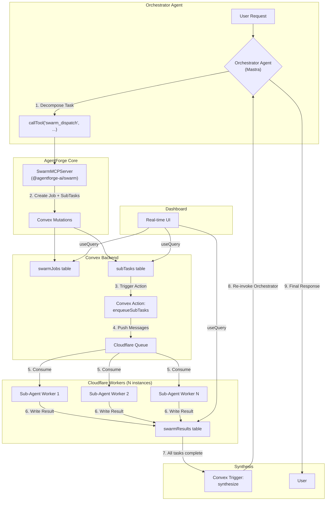
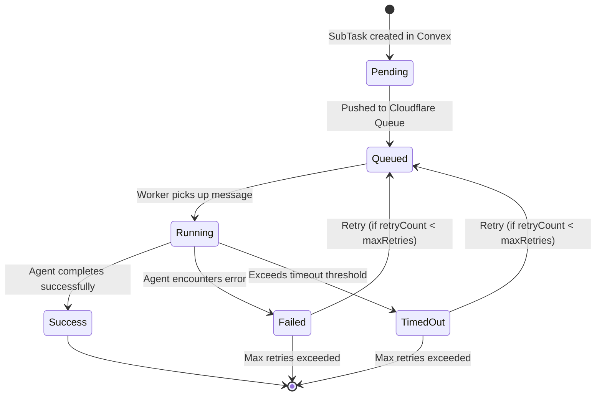

# Spec: [AF-41] Parallel Multi-Agent Orchestration (Agent Swarms)

**Author:** Manus AI
**Date:** 2026-02-17
**Status:** Proposed
**Priority:** P0 (Critical)
**Milestone:** Phase 2: Execution & Voice (Q2 2026)
**Linear:** [AGE-46](https://linear.app/agentic-engineering/issue/AGE-46)
**GitHub:** [agentforge#41](https://github.com/Agentic-Engineering-Agency/agentforge/issues/41)
**Depends On:** AF-1 (Core Agent Class), AF-2 (Convex Schema)
**Blocks:** AF-51 (Deep Research)

---

## 1. Objective

This specification defines the architecture and implementation plan for a parallel multi-agent orchestration system within the AgentForge framework, commonly referred to as "Agent Swarms." This is a P0 (critical) feature on the Phase 2 (Q2 2026) roadmap, designed to close one of the most significant capability gaps between AgentForge and its competitors. Manus's Wide Research feature can dispatch hundreds of parallel sub-agents for research tasks, with each sub-agent operating in its own isolated context before results are synthesized by a main orchestrator [1]. OpenClaw provides `sessions_spawn` and a sub-agents system that allows spawning isolated sessions, monitoring their progress, and steering them in real-time [2]. AgentForge currently supports multi-agent threads but has no mechanism for parallel dispatch, execution, or result aggregation.

The goal of AF-41 is to enable an orchestrator agent to decompose a complex task into N independent sub-tasks, dispatch N sub-agents to execute those tasks concurrently (using Cloudflare Workers for serverless, pay-per-use execution), track their progress in real-time via Convex reactive queries, handle partial failures gracefully, and synthesize the collected results into a coherent final response. This system will serve as the foundation for the Deep Research feature (AF-51), which depends on both AF-40 (Browser Automation) and AF-41.

## 2. Competitive Landscape

The following table compares the parallel agent orchestration capabilities of the four reference systems that informed this specification.

| Feature | Manus Wide Research | OpenClaw Subagents | CrewAI | AutoGen |
| :--- | :--- | :--- | :--- | :--- |
| **Parallel Dispatch** | Hundreds of sub-agents per request | Configurable via `sessions_spawn` | Role-based crews with sequential or parallel tasks | Multi-agent conversation patterns |
| **Isolation** | Opaque cloud VMs (one per sub-agent) | Docker containers with session/agent/shared scope | In-process Python threads | In-process Python threads |
| **State Management** | Proprietary (Meta infrastructure) | Session files, MEMORY.md, daily logs | Shared memory object | Conversation history |
| **Progress Tracking** | Built-in UI with per-agent status | Session monitoring via CLI/API | Callback-based logging | Print-based logging |
| **Failure Handling** | Graceful degradation (delivers partial results) | Session error states, retry logic | Task retry with backoff | Error propagation in conversation |
| **Result Synthesis** | Main agent synthesizes all sub-agent outputs | Manual or agent-driven aggregation | Final task in crew pipeline | Final message in conversation |
| **Cost Model** | Consumer subscription | Self-hosted (BYOK for LLM costs) | Self-hosted (BYOK) | Self-hosted (BYOK) |

Manus Wide Research is the gold standard for this feature. Its key insight, as described in their blog post, is that the main agent decomposes the task, each sub-agent works independently in its own context (solving the context window limitation), and the main agent then synthesizes all results [1]. OpenClaw's approach is more developer-oriented, giving fine-grained control over session spawning and monitoring. CrewAI and AutoGen are Python-based frameworks that run agents in-process, which limits scalability compared to a serverless approach.

AgentForge's design will combine the best aspects of these systems: Manus's decompose-execute-synthesize pattern, OpenClaw's session isolation model, and a Cloudflare Workers-based execution layer that provides true serverless scalability with V8 isolate-level security.

## 3. High-Level Architecture

The architecture leverages the existing AgentForge stack. Convex serves as the central job queue and state manager, providing real-time reactivity for the dashboard. Cloudflare Workers handle the massively parallel, serverless execution of sub-agents. Cloudflare Queues provide reliable message delivery between the Convex backend and the worker fleet.

### 3.1. System Diagram



### 3.2. Data Flow

The system follows a clear, linear data flow that can be summarized in nine steps:

1. The user sends a complex request to the orchestrator agent.
2. The orchestrator agent analyzes the request and decomposes it into N independent sub-tasks.
3. The orchestrator calls the `swarm_dispatch` tool with the list of sub-tasks and a synthesis prompt.
4. The `SwarmMCPServer` creates a `swarmJob` record and N `subTask` records in Convex.
5. A Convex action is triggered, which pushes N messages to a Cloudflare Queue.
6. N Cloudflare Workers consume the messages, each instantiating a `ConvexAgentAdapter` and running the sub-agent.
7. Each worker writes its result (or error) to the `swarmResults` table in Convex.
8. When all sub-tasks reach a terminal state, a Convex trigger invokes the synthesis action.
9. The orchestrator agent is re-invoked with the synthesis prompt and all collected results, producing the final response.

## 4. Convex Schema Extension

The following three tables will be added to `convex/schema.ts`:

```typescript
// convex/schema.ts (additions)

  swarmJobs: defineTable({
    name: v.string(),
    orchestratorAgentId: v.string(),
    orchestratorThreadId: v.optional(v.id("threads")),
    userId: v.optional(v.string()),
    status: v.union(
      v.literal("pending"),
      v.literal("running"),
      v.literal("synthesizing"),
      v.literal("completed"),
      v.literal("failed")
    ),
    synthesisPrompt: v.string(),
    totalTasks: v.number(),
    completedTasks: v.number(),
    failedTasks: v.number(),
    maxConcurrent: v.number(),
    subAgentModel: v.string(),
    subAgentInstructions: v.string(),
    createdAt: v.number(),
    startedAt: v.optional(v.number()),
    completedAt: v.optional(v.number()),
    finalResult: v.optional(v.string()),
  })
    .index("byOrchestrator", ["orchestratorAgentId"])
    .index("byUserId", ["userId"])
    .index("byStatus", ["status"]),

  subTasks: defineTable({
    swarmJobId: v.id("swarmJobs"),
    taskIndex: v.number(),
    prompt: v.string(),
    status: v.union(
      v.literal("pending"),
      v.literal("queued"),
      v.literal("running"),
      v.literal("success"),
      v.literal("failed"),
      v.literal("timed_out")
    ),
    workerId: v.optional(v.string()),
    retryCount: v.number(),
    maxRetries: v.number(),
    timeoutMs: v.number(),
    createdAt: v.number(),
    queuedAt: v.optional(v.number()),
    startedAt: v.optional(v.number()),
    completedAt: v.optional(v.number()),
  })
    .index("bySwarmJobId", ["swarmJobId"])
    .index("byStatus", ["status"]),

  swarmResults: defineTable({
    subTaskId: v.id("subTasks"),
    swarmJobId: v.id("swarmJobs"),
    result: v.optional(v.string()),
    error: v.optional(v.string()),
    tokenUsage: v.optional(v.object({
      promptTokens: v.number(),
      completionTokens: v.number(),
    })),
    executionTimeMs: v.optional(v.number()),
    createdAt: v.number(),
  })
    .index("bySubTaskId", ["subTaskId"])
    .index("bySwarmJobId", ["swarmJobId"]),
```

The `swarmJobs` table stores the overall job metadata, including the synthesis prompt and the model/instructions to use for sub-agents. The `subTasks` table tracks individual task progress with retry support. The `swarmResults` table stores the output of each sub-agent, including token usage for cost tracking.

## 5. Tool Interface

A new `@agentforge-ai/swarm` package will provide the `SwarmMCPServer` with two tools: `swarm_dispatch` for creating a swarm, and `swarm_status` for checking progress.

### 5.1. SwarmMCPServer

```typescript
// packages/swarm/src/server.ts
import { MCPServer } from '@agentforge-ai/core';
import { z } from 'zod';

const subTaskInputSchema = z.object({
  id: z.string().describe('A unique identifier for this sub-task.'),
  prompt: z.string().describe('The self-contained prompt for the sub-agent.'),
});

const dispatchInputSchema = z.object({
  name: z.string().describe('A human-readable name for this swarm job.'),
  subTasks: z.array(subTaskInputSchema).min(1).max(200)
    .describe('Array of independent sub-tasks to execute in parallel.'),
  synthesisPrompt: z.string()
    .describe('Instructions for synthesizing all sub-task results into a final response.'),
  subAgentModel: z.string().optional()
    .describe('Model to use for sub-agents. Defaults to the orchestrator model.'),
  subAgentInstructions: z.string().optional()
    .describe('System instructions for sub-agents. Defaults to a generic research prompt.'),
});

const statusInputSchema = z.object({
  swarmJobId: z.string().describe('The ID of the swarm job to check.'),
});

export function createSwarmMCPServer() {
  const server = new MCPServer({ name: 'swarm' });

  server.registerTool({
    name: 'swarm_dispatch',
    description: `Dispatch a swarm of parallel agents to execute independent sub-tasks.
      The orchestrator decomposes a complex request into self-contained sub-tasks,
      each executed by an independent sub-agent. Results are automatically collected
      and synthesized into a final response.`,
    inputSchema: dispatchInputSchema,
    outputSchema: z.object({
      swarmJobId: z.string(),
      totalTasks: z.number(),
      status: z.string(),
    }),
    handler: async (input) => {
      // Creates swarmJob and subTask records in Convex
      // Triggers the enqueue action
      // Returns the job ID for status tracking
    },
  });

  server.registerTool({
    name: 'swarm_status',
    description: 'Check the current status of a swarm job.',
    inputSchema: statusInputSchema,
    outputSchema: z.object({
      status: z.string(),
      totalTasks: z.number(),
      completedTasks: z.number(),
      failedTasks: z.number(),
      results: z.array(z.object({
        taskId: z.string(),
        status: z.string(),
        result: z.string().optional(),
        error: z.string().optional(),
      })).optional(),
    }),
    handler: async (input) => {
      // Queries Convex for the current state of the swarm job
    },
  });

  return server;
}
```

### 5.2. Agent Usage Example

```typescript
import { Agent } from '@agentforge-ai/core';
import { createSwarmMCPServer } from '@agentforge-ai/swarm';

const swarmTools = createSwarmMCPServer();

const orchestrator = new Agent({
  id: 'research-orchestrator',
  name: 'Research Orchestrator',
  instructions: `You are a research orchestrator. When the user asks a complex question
    that can be broken into independent sub-questions, decompose it and use the
    swarm_dispatch tool to research each sub-question in parallel. Each sub-task
    prompt must be fully self-contained. After dispatch, the system will automatically
    synthesize results and return the final answer.`,
  model: 'openai/gpt-4o',
});

orchestrator.addTools(swarmTools);

const response = await orchestrator.generate(
  'Compare the pricing, features, and developer experience of Supabase, Convex, and Firebase.'
);
// The orchestrator will decompose this into ~9 sub-tasks (3 topics x 3 platforms),
// dispatch them in parallel, and synthesize a comprehensive comparison.
```

## 6. Task Decomposition Patterns

The quality of the swarm's output depends heavily on how well the orchestrator decomposes the original task. The orchestrator's system prompt will include structured instructions for generating effective sub-tasks.

### 6.1. Decomposition Principles

Each sub-task must be **self-contained**, meaning the sub-agent can complete it without any context from other sub-tasks. Each sub-task must be **independent**, meaning the result of one sub-task does not depend on the result of another. Each sub-task must be **specific**, meaning the prompt clearly defines what information to find and how to structure the output.

### 6.2. Example Decomposition

For the user request "Write a comprehensive market analysis of the AI agent framework space," the orchestrator would generate sub-tasks like:

```json
{
  "name": "ai-agent-framework-market-analysis",
  "subTasks": [
    { "id": "market-size", "prompt": "Research the current market size and growth projections for the AI agent framework market. Include revenue figures, CAGR, and key market reports." },
    { "id": "key-players", "prompt": "Identify and profile the top 10 AI agent framework companies by funding, user base, and market share." },
    { "id": "tech-trends", "prompt": "Research the top 5 technology trends shaping AI agent frameworks in 2025-2026." },
    { "id": "enterprise-adoption", "prompt": "Research enterprise adoption patterns for AI agent frameworks. Include case studies and adoption rates." },
    { "id": "pricing-models", "prompt": "Compare the pricing models of the top 5 AI agent framework platforms." },
    { "id": "open-source-landscape", "prompt": "Map the open-source AI agent framework ecosystem. Include GitHub stars, contributors, and license types." },
    { "id": "regulatory-landscape", "prompt": "Research the regulatory landscape affecting AI agent deployments in the US and EU." }
  ],
  "synthesisPrompt": "You are a market research analyst. Synthesize the following research results into a comprehensive market analysis report with sections for Market Overview, Key Players, Technology Trends, Enterprise Adoption, Pricing Analysis, Open Source Landscape, and Regulatory Considerations. Use tables where appropriate."
}
```

## 7. Sub-Agent Lifecycle and Failure Handling

### 7.1. Lifecycle State Machine



### 7.2. Partial Failure Tolerance

The system is designed for graceful degradation. If some sub-agents fail after exhausting their retries, the swarm job will still proceed to synthesis. The orchestrator will receive the successful results along with error messages for the failed tasks, and its synthesis prompt will instruct it to produce the best possible output with the available data, noting any gaps.

This is a critical design decision inspired by Manus Wide Research, which delivers partial results rather than failing entirely when some research threads encounter errors [1].

### 7.3. Timeout and Retry Configuration

| Parameter | Default | Configurable | Description |
| :--- | :--- | :--- | :--- |
| `timeoutMs` | 120,000 (2 min) | Per sub-task | Maximum execution time for a single sub-agent. |
| `maxRetries` | 2 | Per sub-task | Number of retry attempts after failure or timeout. |
| `retryBackoffMs` | 5,000 | Global | Delay before retrying a failed sub-task. |
| `stalledCheckInterval` | 30,000 | Global | How often the Convex scheduled function checks for stalled tasks. |

## 8. Result Aggregation and Synthesis

The synthesis phase is triggered automatically when all sub-tasks reach a terminal state. A Convex scheduled function monitors the `subTasks` table and triggers synthesis when `completedTasks + failedTasks === totalTasks`.

```typescript
// convex/swarm.ts (illustrative)
import { internalAction } from "./_generated/server";
import { v } from "convex/values";
import { createConvexAgent } from "@agentforge-ai/convex-adapter";

export const synthesize = internalAction({
  args: { swarmJobId: v.id("swarmJobs") },
  handler: async (ctx, { swarmJobId }) => {
    const job = await ctx.runQuery(internal.swarm.getJob, { swarmJobId });
    const results = await ctx.runQuery(internal.swarm.getResults, { swarmJobId });

    const formattedResults = results.map((r, i) => {
      if (r.result) {
        return `## Sub-Task ${i + 1} (SUCCESS)\n${r.result}`;
      } else {
        return `## Sub-Task ${i + 1} (FAILED)\nError: ${r.error}`;
      }
    }).join('\n\n---\n\n');

    const synthesisInput = `${job.synthesisPrompt}\n\n` +
      `Total sub-tasks: ${job.totalTasks}\n` +
      `Successful: ${job.completedTasks}\n` +
      `Failed: ${job.failedTasks}\n\n` +
      `---\n\n${formattedResults}`;

    // Create a synthesis agent and generate the final response
    const synthesizer = createConvexAgent({
      id: `synthesizer-${swarmJobId}`,
      name: 'Swarm Synthesizer',
      instructions: job.synthesisPrompt,
      model: job.subAgentModel,
    });

    const result = await synthesizer.generate(ctx, synthesisInput);

    // Store the final result
    await ctx.runMutation(internal.swarm.completeJob, {
      swarmJobId,
      finalResult: result.content,
    });
  },
});
```

## 9. Resource Management

To prevent runaway costs and ensure fair usage across organizations, the system enforces strict resource limits at multiple levels.

| Limit | Free Tier | Pro Tier | Enterprise Tier |
| :--- | :--- | :--- | :--- |
| **Max Concurrent Sub-Agents** | 5 | 25 | 100 |
| **Max Sub-Tasks per Swarm** | 10 | 50 | 200 |
| **Sub-Agent Timeout** | 60s | 120s | 300s |
| **Max Swarms per Hour** | 5 | 20 | Unlimited |
| **Max Token Budget per Swarm** | 100K | 500K | 2M |

These limits are stored in the organization's settings in Convex and enforced by the `swarm_dispatch` tool handler before any sub-tasks are created. The `usage` table (already in the schema) will be extended to track per-swarm token consumption, enabling accurate cost attribution.

## 10. Real-Time Progress with Convex Reactive Queries

One of AgentForge's key advantages over competitors is Convex's real-time subscription system. The dashboard will provide a live view of swarm execution using `useQuery` hooks that subscribe to the `swarmJobs`, `subTasks`, and `swarmResults` tables.

```typescript
// packages/web/src/components/SwarmDashboard.tsx (illustrative)
import { useQuery } from 'convex/react';
import { api } from '../convex/_generated/api';

export function SwarmDashboard({ swarmJobId }: { swarmJobId: string }) {
  const job = useQuery(api.swarm.getJob, { swarmJobId });
  const tasks = useQuery(api.swarm.getSubTasks, { swarmJobId });

  if (!job || !tasks) return <div>Loading...</div>;

  const successCount = tasks.filter(t => t.status === 'success').length;
  const failedCount = tasks.filter(t => t.status === 'failed' || t.status === 'timed_out').length;
  const runningCount = tasks.filter(t => t.status === 'running').length;

  return (
    <div className="space-y-4">
      <div className="flex items-center gap-4">
        <h2 className="text-xl font-bold">{job.name}</h2>
        <span className="px-2 py-1 rounded bg-blue-100 text-blue-800 text-sm">
          {job.status}
        </span>
      </div>

      <div className="grid grid-cols-4 gap-4">
        <StatCard label="Total" value={job.totalTasks} />
        <StatCard label="Running" value={runningCount} color="blue" />
        <StatCard label="Completed" value={successCount} color="green" />
        <StatCard label="Failed" value={failedCount} color="red" />
      </div>

      <progress
        value={successCount + failedCount}
        max={job.totalTasks}
        className="w-full h-3 rounded"
      />

      <div className="space-y-2">
        {tasks.map(task => (
          <TaskRow key={task._id} task={task} />
        ))}
      </div>

      {job.status === 'completed' && job.finalResult && (
        <div className="mt-6 p-4 bg-green-50 rounded-lg">
          <h3 className="font-bold mb-2">Synthesized Result</h3>
          <div className="prose">{job.finalResult}</div>
        </div>
      )}
    </div>
  );
}
```

Because Convex subscriptions are push-based (not polling), the dashboard updates instantly as each sub-agent completes its task, providing a smooth, real-time experience that rivals Manus's built-in progress UI.

## 11. Integration with Existing AgentForge Systems

The swarm system is designed to integrate seamlessly with the existing AgentForge architecture:

| Existing System | Integration Point |
| :--- | :--- |
| **Agent class** (`@agentforge-ai/core`) | The orchestrator and sub-agents are standard `Agent` instances. No modifications to the core class are needed. |
| **MCPServer** (`@agentforge-ai/core`) | The `SwarmMCPServer` follows the same pattern as all other tool servers. |
| **ConvexAgentAdapter** (`@agentforge-ai/convex-adapter`) | Sub-agents run inside Cloudflare Workers using the adapter for Convex context. |
| **Usage tracking** (`convex/usage.ts`) | Each sub-agent's token usage is recorded in the existing `usage` table, attributed to the swarm job. |
| **Audit logging** (`convex/logs.ts`) | Swarm creation, completion, and failure events are logged to the existing `logs` table. |
| **Heartbeat system** (`convex/heartbeat.ts`) | Long-running swarm jobs will update the heartbeat system to prevent premature cleanup. |

## 12. Implementation Plan

The implementation is divided into three phases, each lasting approximately two weeks, for a total estimated effort of six weeks.

### Phase 1: Convex Backend and Schema (Weeks 1-2)

| Task | Effort | Description |
| :--- | :--- | :--- |
| Schema extension | 1 day | Add `swarmJobs`, `subTasks`, and `swarmResults` tables to `convex/schema.ts`. |
| Convex mutations | 2 days | Implement `createJob`, `createSubTasks`, `updateTaskStatus`, `completeJob` mutations. |
| Convex queries | 1 day | Implement `getJob`, `getSubTasks`, `getResults` queries with real-time subscription support. |
| Enqueue action | 2 days | Implement the Convex action that pushes sub-task messages to Cloudflare Queue. |
| Stalled task checker | 1 day | Implement the scheduled function that detects and handles timed-out tasks. |
| Synthesis trigger | 2 days | Implement the trigger that detects swarm completion and invokes the synthesis action. |
| Unit tests | 1 day | Write tests for all mutations, queries, and actions. |

### Phase 2: Cloudflare Worker and Swarm Package (Weeks 3-4)

| Task | Effort | Description |
| :--- | :--- | :--- |
| Worker scaffolding | 1 day | Create the Cloudflare Worker project with Queue consumer binding. |
| Sub-agent execution | 3 days | Implement the worker logic that instantiates a `ConvexAgentAdapter` and runs the sub-agent. |
| Result writing | 1 day | Implement the logic to write results and errors back to Convex from the worker. |
| `@agentforge-ai/swarm` package | 2 days | Create the npm package with `SwarmMCPServer` and tool definitions. |
| Resource limit enforcement | 1 day | Implement org-level limit checks in the `swarm_dispatch` handler. |
| Integration tests | 2 days | Write end-to-end tests with mock sub-agents. |

### Phase 3: Dashboard UI and Polish (Weeks 5-6)

| Task | Effort | Description |
| :--- | :--- | :--- |
| Swarm dashboard component | 3 days | Build the real-time swarm progress view with Convex reactive queries. |
| Swarm history view | 2 days | Build a view showing past swarm jobs with results and cost attribution. |
| CLI support | 1 day | Add `agentforge swarm list` and `agentforge swarm status` commands to the CLI. |
| Cost tracking integration | 1 day | Extend the `usage` table queries to aggregate per-swarm costs. |
| Documentation | 2 days | Write user-facing documentation, API reference, and examples for the Notion wiki. |
| Performance testing | 1 day | Load test with 50+ concurrent sub-agents to validate scalability. |

**Total Estimated Effort: 6 weeks (1 engineer)**

## 13. Acceptance Criteria

The following criteria must be met for this feature to be considered complete:

1. An orchestrator agent can call `swarm_dispatch` with up to 200 sub-tasks and receive a `swarmJobId`.
2. Sub-agents execute in parallel via Cloudflare Workers, with each worker running an independent `ConvexAgentAdapter` instance.
3. Results are correctly stored in the `swarmResults` table and are queryable via Convex reactive queries.
4. The system gracefully handles partial failures: if 3 out of 10 sub-agents fail, the synthesis still proceeds with the 7 successful results.
5. Timed-out sub-agents are automatically detected and retried up to `maxRetries` times.
6. Resource limits (max concurrent agents, max tasks per swarm, token budgets) are enforced per organization.
7. The AgentForge dashboard displays a real-time swarm progress view with per-task status indicators.
8. Token usage for all sub-agents is tracked in the existing `usage` table and attributed to the swarm job.
9. The `agentforge` CLI supports `swarm list` and `swarm status` commands.
10. The feature is documented in the AgentForge wiki on Notion and the `docs/` directory.
11. All integration tests pass in CI/CD (GitHub Actions).
12. The feature closes the parallel orchestration gap identified in the [Feature Parity comparison](https://www.notion.so/30a20287fd618160b054d463cd8911a3) [3].

## 14. References

[1]: https://manus.im/blog/manus-wide-research-solve-context-problem "Manus Wide Research: Solving the Context Problem"
[2]: https://docs.openclaw.ai/tools/subagents "OpenClaw Subagents Documentation"
[3]: https://www.notion.so/30a20287fd618160b054d463cd8911a3 "Feature Parity: Manus vs OpenClaw vs AgentForge"
[4]: https://developers.cloudflare.com/queues/ "Cloudflare Queues Documentation"
[5]: https://docs.crewai.com/ "CrewAI Documentation"
